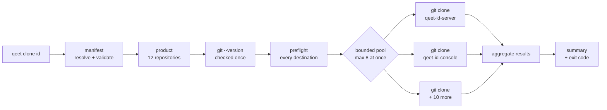
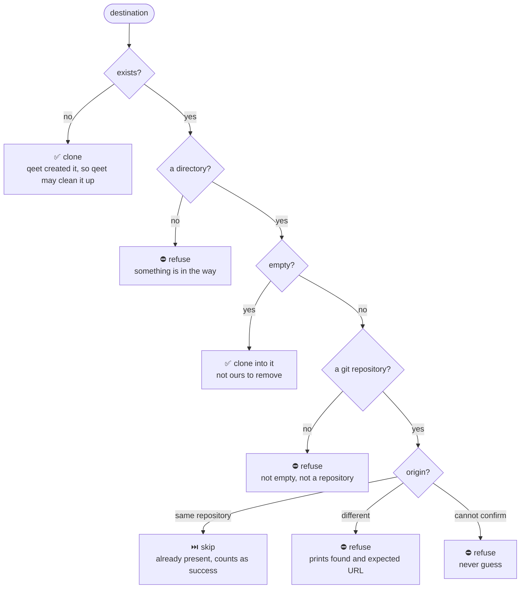
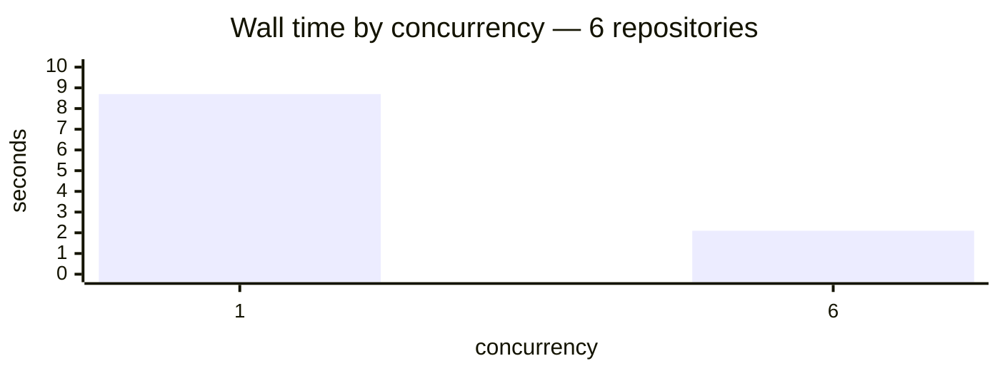
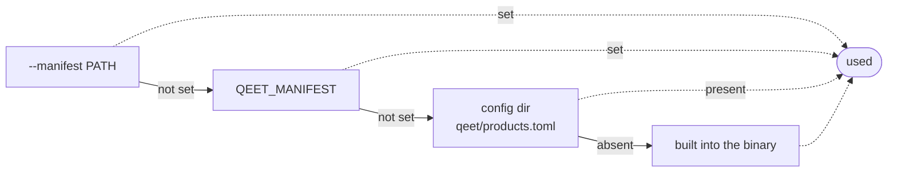
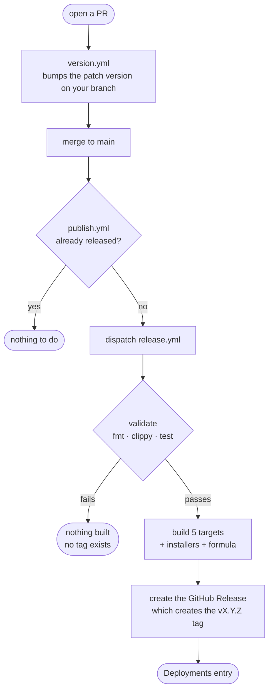

<div align="center">

<h1>Qeet CLI</h1>

<p><b>Clone every repository belonging to a Qeet product with one command.</b></p>

<p>
<a href="https://github.com/qeetgroup/qeet-cli/actions/workflows/ci.yml"></a>
<a href="https://github.com/qeetgroup/qeet-cli/releases/latest"></a>
<a href="https://github.com/qeetgroup/qeet-cli/releases"></a>
<a href="https://github.com/qeetgroup/qeet-cli/commits/main"></a>
<a href="LICENSE"></a>


</p>

```bash
brew tap qeetgroup/tap && brew install qeet
qeet clone id
```

</div>

---

## Contents

| | | |
|---|---|---|
| [Overview](#overview) | [Installation](#installation) | [Commands](#usage) |
| [How it works](#how-it-works) | [Workspace layout](#workspace-layout) | [Concurrency](#concurrency) |
| [Authentication](#authentication) | [Manifest format](#manifest-format) | [Exit codes](#exit-codes) |
| [Troubleshooting](#troubleshooting) | [Development](#development) | [Limitations](#limitations) |

---

## Overview

Qeet CLI resolves a product to its repositories from a data-driven manifest and clones them
**concurrently**, with a bounded number of git processes at a time. It **orchestrates** git —
it does not replace it, reimplement it, or manage credentials for it.

```console
$ qeet clone id
Qeet ID — 12 repositories

  qeet-id-server   ✓ cloned in 3.1s
  qeet-id-console  ✓ cloned in 2.4s
  qeet-id-login    ✓ cloned in 2.2s
  qeet-id-website  ✓ cloned in 1.9s
  qeet-id-auth     ✓ cloned in 2.8s
  qeet-id-docs     ✓ cloned in 1.7s
  qeet-id-go       ✓ cloned in 1.1s
  qeet-id-node     ✓ cloned in 1.3s
  qeet-id-react    ✓ cloned in 1.2s
  qeet-id-deploy   ✓ cloned in 0.9s
  qeet-id-files    ✓ cloned in 0.8s
  qeet-id-context  ✓ cloned in 0.7s

Qeet ID: 12 of 12 repositories in 5.4s.

  Cloned:          12
  Failed:          0
```

### Before and after

| | Without Qeet CLI | With Qeet CLI |
|---|---|---|
| Commands to type | up to 12 `git clone`s | **1** |
| Do you need the repo list? | yes, from memory or a wiki | no, it ships in the binary |
| Execution | sequential | **concurrent, bounded** |
| Wall time, 6 repositories | 8.7s | **2.1s** |
| Safe to re-run? | you get "already exists" errors | yes — reports "already present", exits `0` |
| A repo you cannot access | stops you mid-way | others still clone, one clear report at the end |

<table>
<tr><td><b>One command</b></td><td><code>qeet clone &lt;product&gt;</code> instead of up to twelve <code>git clone</code>s</td></tr>
<tr><td><b>Concurrent</b></td><td>~4× faster than sequential, measured on a six-repository product</td></tr>
<tr><td><b>Safe</b></td><td>Nothing existing is ever deleted or overwritten; re-runs are a no-op</td></tr>
<tr><td><b>Honest errors</b></td><td>Real git output, classified, with concrete next steps — never <code>exit code 128</code></td></tr>
<tr><td><b>Local-first</b></td><td>No backend, no telemetry, no network call to resolve a product</td></tr>
</table>

### Scope

v1 does one thing. There is deliberately no `qeet status`, `pull`, `sync`, `graph` or `dev`,
no dependency graph, no remote registry, no backend service, and no telemetry. See
[docs/decisions.md](docs/decisions.md) for what is deferred and why.

---

## How it works

Everything that can fail cheaply fails **before** anything expensive or destructive happens.
By the time the first git process starts, the manifest is valid, the product exists, git
works, and every destination has been classified.



A repository that fails never cancels one still running, and every repository appears in the
final report.

---

## Installation

### Homebrew — macOS and Linux

```bash
brew tap qeetgroup/tap    # once per machine
brew install qeet
```

After that one-time tap, `brew install qeet` and `brew upgrade qeet` are all you ever need —
Homebrew searches your taps, so the short name resolves.

Prefer a single line? `brew install qeetgroup/tap/qeet` taps and installs together, and is
exactly equivalent.

Upgrading later:

```bash
brew update && brew upgrade qeet
```

> [!NOTE]
> `brew install qeet` on a machine with **no** tap at all would need
> [homebrew-core](https://github.com/Homebrew/homebrew-core), which requires ≥75 stars, ≥30
> forks or ≥30 watchers and does not accept third-party prebuilt binaries. That is the only
> thing still missing — the tap gives you the short command today.

### macOS and Linux — install script

```bash
curl --proto '=https' --tlsv1.2 -fsSL \
  https://github.com/qeetgroup/qeet-cli/releases/latest/download/qeet-cli-installer.sh | sh
```

Detects your OS and architecture, downloads the matching archive, **verifies its SHA-256
checksum**, and installs `qeet` to `~/.local/bin`. No root, no `sudo`.

> [!NOTE]
> A shorter `https://get.qeet.in/cli` endpoint is planned. Its DNS is in place but no host
> serves it yet, so this README does not document it as a command. See
> [docs/releasing.md](docs/releasing.md#getqeetin).

### Windows — PowerShell

```powershell
irm https://github.com/qeetgroup/qeet-cli/releases/latest/download/qeet-cli-installer.ps1 | iex
```

### Supported platforms

| Platform | Target | Archive | Status |
|---|---|---|---|
| macOS, Apple silicon | `aarch64-apple-darwin` | `.tar.xz` | ✅ built · manually tested |
| macOS, Intel | `x86_64-apple-darwin` | `.tar.xz` | ✅ built in CI |
| Linux, x86_64 | `x86_64-unknown-linux-gnu` | `.tar.xz` | ✅ built in CI |
| Linux, arm64 | `aarch64-unknown-linux-gnu` | `.tar.xz` | ✅ built natively in CI |
| Windows, x86_64 | `x86_64-pc-windows-msvc` | `.zip` | ✅ built + tested in CI |

### Verify

```bash
qeet --version
```

Installed via the script and getting `command not found`? `~/.local/bin` is not on your
`PATH` in this shell yet. Open a new one, or:

```bash
. "$HOME/.local/bin/env"
```

Then clone something:

```bash
qeet clone id
```

<details>
<summary><b>What the install script writes to your machine</b></summary>

Worth knowing before you run it, since it edits shell configuration. Verified by running the
published installer against a sandboxed `HOME`:

| Path | Purpose |
|---|---|
| `~/.local/bin/qeet` | The binary |
| `~/.local/bin/env`, `env.fish` | Prepends `~/.local/bin` to `PATH`, idempotently |
| `~/.profile` | Adds `. "$HOME/.local/bin/env"`, only if absent |
| `~/.zshrc` | Same line |
| `~/.config/fish/conf.d/qeet-cli.env.fish` | The fish equivalent |
| `~/.config/qeet-cli/qeet-cli-receipt.json` | Install receipt, for uninstalling |

To manage `PATH` yourself and leave every shell config untouched:

```bash
curl -fsSL <installer-url> | QEET_CLI_NO_MODIFY_PATH=1 sh
```

| Variable | Effect |
|---|---|
| `QEET_CLI_INSTALL_DIR` | Install somewhere other than `~/.local/bin` |
| `QEET_CLI_NO_MODIFY_PATH=1` | Do not touch any shell startup file |
| `QEET_CLI_PRINT_VERBOSE=1` | Verbose output |

</details>

<details>
<summary><b>Pinning a version, manual download, and building from source</b></summary>

`latest` always fetches the newest release. For a reproducible install — CI, for example —
name the release:

```bash
curl -fsSL https://github.com/qeetgroup/qeet-cli/releases/download/v0.1.2/qeet-cli-installer.sh | sh
```

Archives and checksums for every platform are on the
[Releases](https://github.com/qeetgroup/qeet-cli/releases) page. Verify before running:

```bash
sha256sum -c qeet-cli-aarch64-apple-darwin.tar.xz.sha256
```

From source:

```bash
cargo install --git https://github.com/qeetgroup/qeet-cli --locked
```

</details>

### Prerequisites

- **git**, on your `PATH`. Qeet CLI checks once at startup and stops with a clear message if
  it is missing.
- Working git authentication for the repositories you are cloning — your existing SSH key,
  credential helper or `insteadOf` rewrite. Qeet CLI adds nothing and stores nothing.

Nothing else. No runtime, no Docker, no configuration file, no network call to resolve
products.

### Uninstalling

```bash
brew uninstall qeet && brew untap qeetgroup/tap   # Homebrew
rm ~/.local/bin/qeet                              # install script
```

---

## Usage

```bash
qeet products              # what can I clone?
qeet repos id              # which repositories, and where will they land?
qeet clone id              # clone them, concurrently
qeet clone all             # every product
qeet status id             # what is on disk, and how does it compare?
qeet update id             # fast-forward what can be fast-forwarded
qeet doctor                # can this machine actually use qeet?
qeet self-update           # update the CLI itself
```

| Command | Touches your files? | What it does |
|---|:---:|---|
| `products` | no | Lists every product, its repository count and its group directory |
| `repos <product>` | no | Lists a product's repositories and their resolved clone URLs |
| `status <product>` | no | Per repository: branch, clean/dirty, ahead/behind, or not cloned |
| `doctor` | no | Checks git, the manifest in effect, workspace writability, and whether your git identity can actually reach the configured remote |
| `clone <product>` | creates | Clones what is missing. Never overwrites or deletes anything existing |
| `update <product>` | **modifies** | Fast-forwards only what is unambiguous. Skips and names everything else |
| `self-update` | no | Works out how qeet was installed and tells you the one command to run |

### `qeet update` is deliberately timid

It is the only command that changes an existing repository, so it advances one **only** when
the outcome is unambiguous: clean, on a branch, tracking an upstream, nothing unpushed, and
strictly behind. `git merge --ff-only` enforces that at the git level — it refuses rather
than creating a merge commit, so `update` cannot invent history or leave a conflict behind.

Everything else is skipped and named:

```console
$ qeet update id
Qeet ID

  qeet-id-server   ✓ fast-forwarded 3 commit(s)
  qeet-id-console  ! skipped: 2 uncommitted changes
  qeet-id-login    ! skipped: diverged: 2 ahead, 4 behind
  qeet-id-auth     ! skipped: detached HEAD
  qeet-id-go       · already up to date
  qeet-id-docs     ○ not cloned

  updated 1  ·  up to date 1  ·  skipped 3  ·  not cloned 1  ·  failed 0
  Skipped repositories were left exactly as they were. Resolve them by hand.
```

Use `--dry-run` to see what it would do without fetching or merging anything.

### Options

The full option set, deliberately small:

| Option | Default | Meaning |
|---|---|---|
| `--concurrency <N>` | available parallelism, capped at 8 | Repositories to clone at once. Range 1–64. |
| `--protocol <ssh\|https>` | from the manifest | Override the default git transport. Repositories with an explicit `url` are unaffected. |
| `--manifest <PATH>` | built-in registry | Use this manifest instead. |

```bash
qeet clone pay
qeet clone logs --concurrency 4
qeet clone people --protocol https
qeet clone id --manifest ./my-products.toml
```

`--protocol` changes only how URLs are *derived* from the manifest's `[remote]` section. It
does not inspect, mirror or modify your `gh` or git authentication settings.

### Products

Keys are canonical lowercase. Lookup is case-insensitive and trims whitespace, so
`qeet clone ID` and `qeet clone id` are the same request.

Ask for one that does not exist and Qeet CLI lists the ones that do, with a suggestion:

```console
$ qeet clone poeple
Unknown product: poeple

Did you mean `people`?

Available products:
  ai
  calendar
  ...
```

---

## Workspace layout

**Flat.** `qeet clone id` clones into the current directory, with no product directory in
between:

```text
~/projects/qg/
├── qeet-id-server/
├── qeet-id-console/
├── qeet-id-login/
└── ...
```

Repository names are unique across the Qeet Group organization, so a flat layout cannot
collide within a product or between two products.

### What happens when something is already there

Every destination is classified **before any git process starts**. Nothing existing is ever
deleted or overwritten.



`origin` comparison is **semantic**, not string equality:
`git@github.com:qeetgroup/x.git` and `https://github.com/qeetgroup/x.git` are recognised as
the same repository. Where identity cannot be established with confidence, Qeet CLI refuses
rather than guessing — assuming "same repository" is the one wrong guess that could cost you
work.

### Re-running is safe

```bash
qeet clone id     # clones what is missing
qeet clone id     # reports everything already present, exits 0
```

A second run never destroys and re-clones. Local commits, branches and uncommitted work are
untouched.

---

## Concurrency

Clones run concurrently with a **bounded** number of git processes — bounded because 66
simultaneous git processes would exhaust file descriptors and invite rate limiting from the
remote. There is no unlimited mode.

Measured on Qeet Logs (6 repositories, over HTTPS, one run each):



Roughly 4×, and it scales with the size of the product. Your numbers will differ with network
and repository size; the point is that the concurrency is real rather than cosmetic.

```bash
qeet clone id --concurrency 4
```

### Cancelling

`Ctrl-C` stops launching new clones, kills the git processes already running rather than
orphaning them, leaves every completed repository intact, removes only the partial output of
this run, prints a summary, and exits `1`.

---

## Authentication

Qeet CLI uses the git you already have configured, and deliberately owns none of it. It does
not store credentials, read your tokens, modify your SSH configuration, or touch your git
credential settings.

One thing it does change, and only for the git processes it spawns:

- **`GIT_TERMINAL_PROMPT=0` is always set.** With several clones in flight on one terminal,
  interleaved credential prompts are unreadable and a single stalled child would hold up the
  whole run. Authentication therefore either succeeds or fails fast with a clear message.
- **SSH batch mode** (`GIT_SSH_COMMAND="ssh -o BatchMode=yes"`) is applied *only* if you have
  set neither `GIT_SSH_COMMAND` nor `core.sshCommand`. If you have configured either, Qeet
  CLI leaves it exactly as you set it.

If you prefer HTTPS over the manifest's SSH default, either pass `--protocol https` or let
git rewrite it for you, which Qeet CLI inherits for free:

```bash
git config --global url."https://github.com/".insteadOf "git@github.com:"
```

<details>
<summary><b>If you use a dedicated SSH key for Qeet Group</b></summary>

A common setup is a per-organization SSH host alias, so a work laptop can hold more than one
GitHub identity:

```sshconfig
# ~/.ssh/config
Host github-qg
    HostName github.com
    IdentityFile ~/.ssh/id_ed25519_qg
    IdentitiesOnly yes
```

The built-in registry derives URLs from `github.com`, which would reach your *other* identity
and report private repositories as "not found". Confirm which account git is using:

```bash
ssh -T git@github.com     # names the account
ssh -T git@github-qg      # should name your Qeet account
```

Point the manifest at the alias instead, once:

```bash
# `qeet doctor` prints the exact path for your platform.
mkdir -p ~/Library/Preferences/qeet
curl -fsSL https://raw.githubusercontent.com/qeetgroup/qeet-cli/main/config/products.toml \
  | sed 's/^host     = "github.com"$/host     = "github-qg"/' \
  > ~/Library/Preferences/qeet/products.toml
```

Then confirm it took effect:

```console
$ qeet doctor
  ssh identity   ✓ authenticates as msboffl
  remote access  ✓ can reach qeet-ai-files over ssh
```

Every later `qeet clone` picks that up automatically. `--protocol https` also works and needs
no configuration at all.

</details>

---

## Manifest format

The product registry is data, not code. **Adding a product or moving a repository between
products never requires a code change.**

```toml
schema = 1

[remote]
host     = "github.com"
owner    = "qeetgroup"
protocol = "ssh"          # ssh | https

[products.id]
name = "Qeet ID"
repositories = [
  { name = "qeet-id-server" },
  { name = "qeet-id-console" },
]
```

Only `name` is required. The clone URL is derived from `[remote]` plus the name, so 66 URLs
are not written out by hand.

| Field | | Meaning |
|---|---|---|
| `name` | **required** | Repository name, and the destination directory unless `path` says otherwise |
| `url` | optional | Full override. Used exactly as written, whatever `--protocol` says |
| `path` | optional | Destination relative to the workspace. Must stay inside it |
| `ref` | optional | Branch or tag to clone instead of the remote's default |

### Where the manifest comes from

First match wins:



The config directory is `~/Library/Preferences/qeet/` on macOS, `$XDG_CONFIG_HOME/qeet/` on
Linux and `%APPDATA%\qeet\` on Windows. Rather than reasoning about that, ask:

```bash
qeet doctor      # prints the resolved path, and whether a config is in effect
```

The built-in registry is why `qeet clone id` works the moment you install it, with no setup
and no network call.

> [!NOTE]
> **It is a release-time snapshot.** When the organization gains or loses a repository, either
> Qeet CLI is released again or you point one of the three overrides at a newer manifest.
> [`config/products.toml`](config/products.toml) is that snapshot; it is transcribed from the
> Qeet Group L0 repository registry and cross-checked against the live organization.

### Validation

The whole manifest is validated before any git process starts, and **every** problem is
reported at once — fixing a 66-repository manifest one error per run would be miserable.
Checked: schema version, TOML syntax with line and column, product keys and names, non-empty
repository lists, duplicate repository names, unknown fields, transport allowlisting, paths
that are relative and stay inside the workspace, and colliding destinations.

---

## Exit codes

| Code | Meaning |
|:---:|---|
| `0` | Every repository was cloned or was already present |
| `1` | One or more repositories failed, or the run was cancelled |
| `2` | Command-line misuse. `--help` and `--version` exit `0` |
| `3` | Configuration problem: unusable manifest, unknown product, or no usable git |

git's own exit code is never surfaced as Qeet CLI's — git reports almost everything as 128,
which would tell a script nothing.

### Output streams

| Stream | Carries |
|---|---|
| **stdout** | The result: the final summary, and nothing else |
| **stderr** | Progress and diagnostics |

So `qeet clone id > summary.txt` still shows you failures on the terminal. Progress is a live
display on a terminal and deterministic one-line-per-event text anywhere else, so CI logs
stay readable.

---

## Troubleshooting

<details>
<summary><b><code>Git authentication failed</code></b></summary>

Your SSH key or credential helper was not accepted for that host. `ssh -T git@github.com`
should greet you by username. Qeet CLI runs git non-interactively, so git cannot prompt you
for a password — fix the credential itself.
</details>

<details>
<summary><b><code>The repository does not exist, or you cannot access it</code></b></summary>

GitHub returns the same answer for "no such repository" and "you cannot see this private
repository". Check the name in the manifest, then your organization access.

If this happens for *every* private repository but public ones clone fine, you are almost
certainly authenticating as the wrong identity — see the dedicated-SSH-key note under
[Authentication](#authentication). Confirm with `ssh -T git@github.com`, which names the
account git is using.
</details>

<details>
<summary><b><code>a different repository is already here</code></b></summary>

The destination holds another repository. Qeet CLI prints both URLs; move or rename the
directory, or fix the manifest.
</details>

<details>
<summary><b><code>the directory is not empty and is not a git repository</code></b></summary>

Something else is in the way. Qeet CLI will not touch it. Move it aside and run again.
</details>

<details>
<summary><b><code>unsupported manifest schema N</code></b></summary>

The manifest is newer than this binary. Update Qeet CLI.
</details>

<details>
<summary><b>A clone hangs</b></summary>

It should not — prompts are disabled. If a third-party credential helper opens a GUI of its
own, Qeet CLI cannot see or suppress that. Cancel with `Ctrl-C` and check your helper.
</details>

<details>
<summary><b>Which manifest am I using?</b></summary>

Qeet CLI prints `manifest: …` whenever it is *not* using the built-in registry. No such line
means the built-in one.
</details>

---

## Development

```bash
git clone git@github.com:qeetgroup/qeet-cli.git
cd qeet-cli
cargo build
cargo test
cargo run -- --help
```

You need Rust 1.87 or newer (the declared `rust-version`, checked by CI) and git. Nothing
else — no Docker, no services, no credentials. The integration tests create real bare
repositories in temporary directories and clone them over `file://` with the real git
executable, so they need no network and no GitHub access.

### Quality gates

Exactly what CI runs, and all four must pass:

```bash
cargo fmt --all --check
cargo clippy --all-targets --all-features -- -D warnings
cargo test --all-features
cargo build --release --all-features
```

### Architecture

```text
src/
├── main.rs        thin: parse, dispatch, exit
├── cli.rs         clap definitions and the exit-code mapping
├── error.rs       domain errors and the exit-code contract
├── remote.rs      URL derivation, transport allowlist, identity comparison
├── product.rs     product key resolution
├── workspace.rs   destination planning and preflight safety
├── commands/      the clone pipeline
├── manifest/      types, source precedence, validation
├── git/           the git adapter and failure classification
├── clone/         bounded concurrent coordinator and reporting
└── output/        interactive and plain renderers
```

See [docs/architecture.md](docs/architecture.md) for how these fit together, and
[docs/decisions.md](docs/decisions.md) for why they are the way they are.

### Re-verifying the registry

One test is ignored by default because it needs network access and an authenticated `gh`,
which organization standards say tests must not depend on. Run it deliberately when the
organization changes:

```bash
cargo test --test manifest -- --ignored
```

It fails if `config/products.toml` names a repository that no longer exists, or if the
organization has a repository that belongs to no product and is not explicitly excluded.

### Releasing

Open a PR — the patch version is bumped on your branch automatically — then merge to `main`.
That is the whole trigger.



A `vX.Y.Z` tag therefore only ever exists for a version whose builds actually passed. Full
detail in **[docs/releasing.md](docs/releasing.md)**.

---

## Limitations

- **`brew install qeet` needs the tap first** (`brew tap qeetgroup/tap`). Working with no tap
  at all would require homebrew-core, which is not yet reachable.
- **The tap is not updated automatically** on release — it needs a token and an attribution
  fix, so `brew upgrade qeet` can lag a release. See [docs/releasing.md](docs/releasing.md).
- **`get.qeet.in` is not live.** DNS is in place; no host serves it yet. It is optional —
  both documented install paths work without it.
- The built-in registry is a snapshot, not a live lookup.
- The Homebrew formula has no `brew test` block — cargo-dist does not generate one.
- Homebrew formula publishing is not yet automatic; it needs a token and an attribution fix.
- A symlinked destination is refused rather than followed, even when it points somewhere
  legitimate inside the workspace.
- Progress is per repository, not per object. Qeet CLI does not stream git's own progress,
  because several interleaved git progress bars are unreadable.
- No shell completions yet.

## Future scope

The architecture leaves room for `qeet status`, `pull`, `sync` and a remote registry — the
manifest is already data-driven and the git adapter is already a trait. **None of them is
implemented, and none should be until `qeet clone` is excellent.**

---

<div align="center">

**[Documentation](docs/)** · **[Releases](https://github.com/qeetgroup/qeet-cli/releases)** · **[Contributing](CONTRIBUTING.md)** · **[Security](SECURITY.md)**

MIT © 2026 Qeet Group

</div>
